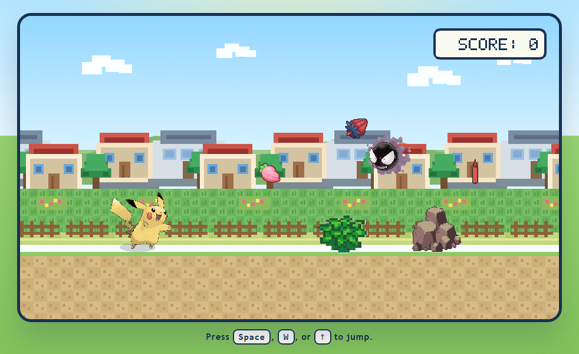
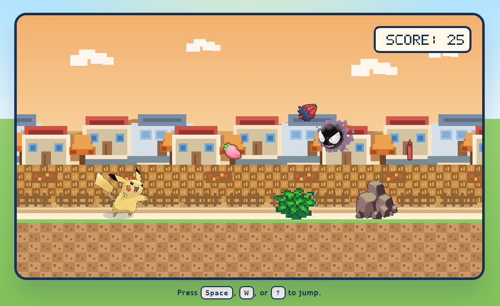
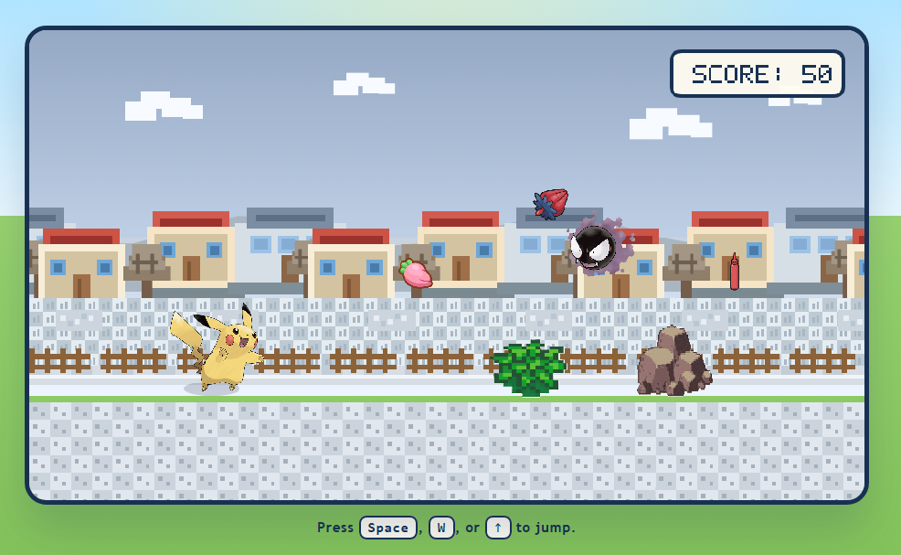
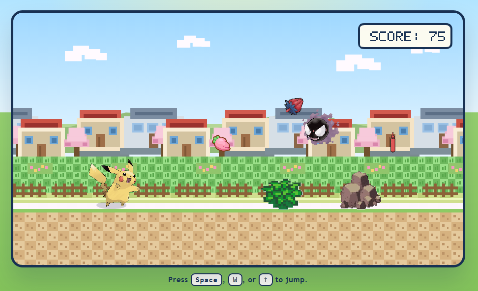
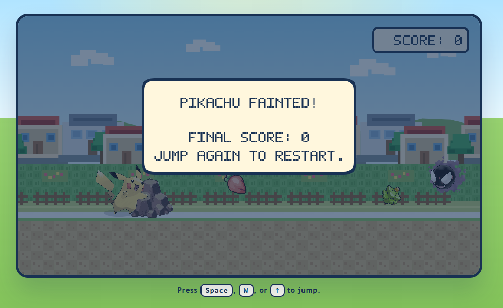
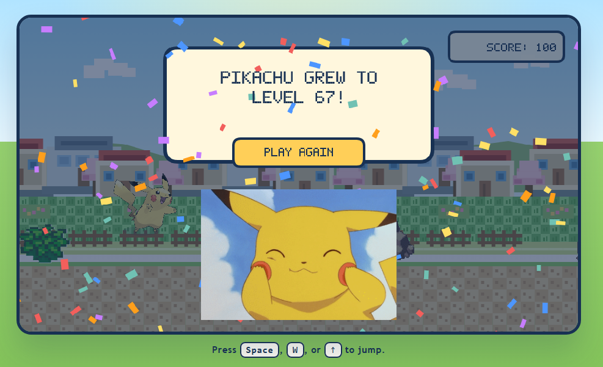

[README.md](https://github.com/user-attachments/files/27420211/README.md)

# Pikachu Runner

Pikachu Runner is a browser-based 2D runner game built with HTML, CSS, and JavaScript. The player controls Pikachu as it runs through a Pokemon-inspired world, jumps over obstacles, collects berries, and earns points while the environment changes through the seasons.

## Screenshots

### Seasonal Progression

The world changes through the seasons as the score increases, giving each stage of the run a different visual feel.

| Summer | Autumn |
| --- | --- |
|  |  |

| Winter | Spring |
| --- | --- |
|  |  |

### End Screens

The game ends with either a lose screen or a level-up celebration when Pikachu reaches 100 points.

## Gameplay

- Jump up to 3 times consecutively to avoid obstacles and collect items.
- Collect a variety of berries for 1 point each.
- Collect Pikachu's favourite food, ketchup, for 10 points.
- Avoid obstacles including bushes, boulders, and Gastly.
- At 50 points, the game becomes harder because Gastly starts drifting randomly.
- At 100 points, the player reaches the win screen with a level-up celebration.

## Features

- Multiple berry varieties used in random order during gameplay
- Seasonal background progression as the score increases
- Summer, autumn, winter, and spring visual changes
- Increasing difficulty as the run continues
- Sound effects and music for gameplay, jumping, losing, and winning
- Win celebration screen with confetti and animated Pikachu
- Responsive layout for desktop and mobile browsers
- Compatible with mobile devices for public web play

## Scoring

- Berry: 1 point
- Ketchup: 10 points
- Win condition: 100 points

## Difficulty Progression

- `0-24`: Summer
- `25-49`: Autumn
- `50-74`: Winter
- `75-99`: Spring
- `100`: Pikachu reaches level 67

At 50 points, Gastly begins moving in a more unpredictable drifting pattern to make the game more challenging.

## Audio

The game supports:

- Background music during play
- Jump sound effect
- Lose sound effect
- Win sound effect

Audio files are loaded from the `assets` folder.

## Run Locally

1. Open the project folder.
2. Open `index.html` in a browser.

You can also use URL parameters for previews:

- `?score=0` for summer preview
- `?score=25` for autumn preview
- `?score=50` for winter preview
- `?score=75` for spring preview
- `?score=100` for win screen preview
- `?playScore=50` to start a playable run at score 50

## Project Structure

- `index.html` - main page
- `styles.css` - styling and responsive layout
- `game.js` - game logic, drawing, scoring, audio, and win/lose states
- `assets/` - images, GIFs, and audio files

## Deploying to GitHub Pages

This is a static project, so it can be deployed directly with GitHub Pages.

1. Create a public GitHub repository.
2. Upload all files from this project folder, including the `assets` folder.
3. Open the repository on GitHub.
4. Go to `Settings` -> `Pages`.
5. Under `Build and deployment`, choose:
   - `Source`: `Deploy from a branch`
   - `Branch`: `main`
   - `Folder`: `/ (root)`
6. Save the settings.
7. Wait for GitHub Pages to publish the site.

Your live site will be available at:

`https://your-username.github.io/your-repository-name/`

## Notes

This project is intended as a personal and portfolio game project with Pokemon-inspired visuals and naming.
This project was built with AI-assisted development using Codex, with gameplay direction, visual choices, and iterative refinements guided by the project owner.
